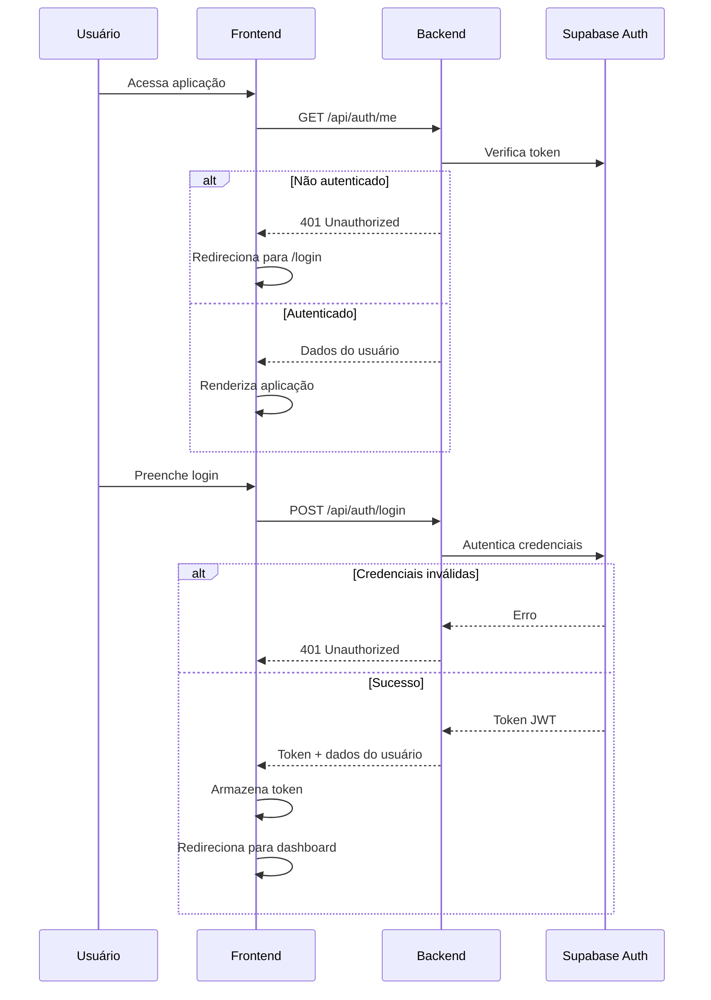

# Sistema de Autenticação com Níveis de Permissão

## Visão Geral

Implementar sistema completo de autenticação integrado ao Supabase Auth, com controle de acesso baseado em dois níveis de permissão:

- **Administrador**: Acesso total ao sistema
- **Usuário**: Acesso restrito apenas aos seus próprios veículos

## Arquitetura

### Backend

#### 1. Schema e Banco de Dados (`shared/schema.ts`)

- Adicionar tipos e schemas Zod para:
  - `User` com campos: `id`, `email`, `username`, `role` (admin | user)
  - `UserVehicle` para relacionamento many-to-many
  - `LoginSchema` e `AuthResponseSchema`
  - Enum `UserRole` com valores "admin" e "user"

#### 2. Storage Layer (`server/storage.ts` e `server/supabase-storage.ts`)

- Estender `IStorage` com métodos:
  - `getUserByEmail(email: string): Promise<User | undefined>`
  - `getUserVehicles(userId: string): Promise<Vehicle[]>`
  - `createUserVehicle(userId: string, vehicleId: string): Promise<void>`
  - `deleteUserVehicle(userId: string, vehicleId: string): Promise<void>`
- Modificar métodos existentes para aceitar filtro de usuário:
  - `getVehicles(userId?: string): Promise<Vehicle[]>` - filtrar por usuário se não for admin
  - `getAlerts(userId?: string): Promise<Alert[]>` - filtrar alertas dos veículos do usuário
  - Aplicar mesmo padrão para `getTrips`, `getSpeedViolations`, etc.

#### 3. Autenticação (`server/auth.ts` - novo arquivo)

- Criar middleware `authenticate` para validar token JWT do Supabase
- Criar middleware `authorize(roles: UserRole[])` para verificar permissões
- Criar helper `getUserIdFromRequest(req)` para extrair ID do usuário autenticado

#### 4. Rotas de Autenticação (`server/routes.ts`)

- Adicionar endpoints:
  - `POST /api/auth/login` - autenticar via Supabase Auth
  - `POST /api/auth/logout` - encerrar sessão
  - `GET /api/auth/me` - retornar dados do usuário autenticado
- Proteger todas as rotas existentes com middleware `authenticate`
- Aplicar `authorize(['admin'])` em rotas administrativas (criar/editar/excluir veículos, usuários, etc.)
- Modificar rotas GET para filtrar dados baseado no role do usuário

#### 5. Configuração Supabase (`server/supabase.ts`)

- Criar cliente Supabase para autenticação (usando anon key para frontend)
- Manter service key para operações administrativas no backend

### Frontend

#### 6. Context de Autenticação (`client/src/contexts/auth-context.tsx` - novo arquivo)

- Criar `AuthContext` com:
  - Estado do usuário autenticado
  - Funções `login`, `logout`, `checkAuth`
  - Estado de loading da autenticação
- Usar Supabase client para gerenciar sessão

#### 7. Tela de Login (`client/src/pages/login.tsx` - novo arquivo)

- Formulário com campos email e senha
- Validação usando react-hook-form + zod
- Integração com endpoint `/api/auth/login`
- Redirecionamento após login bem-sucedido
- Tratamento de erros com mensagens amigáveis

#### 8. Proteção de Rotas (`client/src/components/protected-route.tsx` - novo arquivo)

- Componente `ProtectedRoute` que:
  - Verifica se usuário está autenticado
  - Redireciona para `/login` se não estiver
  - Aceita prop `requiredRole` para verificar permissões
  - Mostra loading durante verificação

#### 9. Hook de Autenticação (`client/src/hooks/use-auth.ts` - novo arquivo)

- Hook `useAuth()` que retorna:
  - `user`, `isAuthenticated`, `isAdmin`, `isUser`
  - `login`, `logout`
  - `loading`

#### 10. Modificações no App (`client/src/App.tsx`)

- Envolver aplicação com `AuthProvider`
- Adicionar rota `/login`
- Proteger todas as rotas existentes com `ProtectedRoute`
- Redirecionar `/` para `/login` se não autenticado

#### 11. Sidebar (`client/src/components/app-sidebar.tsx`)

- Filtrar itens do menu baseado em permissões:
  - Usuários comuns não veem: "Veículos" (CRUD), "Geofences", "Relatórios" administrativos
  - Mostrar apenas "Dashboard", "Histórico" (filtrado), "Alertas" (filtrados)
- Adicionar botão de logout no footer
- Mostrar nome do usuário e role

#### 12. Modificações nas Páginas

- **Dashboard** (`client/src/pages/dashboard.tsx`):
  - Filtrar veículos por usuário se não for admin
  - Ocultar controles administrativos

- **Veículos** (`client/src/pages/vehicles.tsx`):
  - Restringir acesso apenas para admins
  - Se usuário comum acessar, redirecionar ou mostrar apenas seus veículos

- **Histórico** (`client/src/pages/history.tsx`):
  - Filtrar viagens apenas dos veículos do usuário

- **Alertas** (`client/src/pages/alerts.tsx`):
  - Filtrar alertas apenas dos veículos do usuário

- **Relatórios** (`client/src/pages/reports.tsx`):
  - Restringir acesso apenas para admins

- **Geofences** (`client/src/pages/geofences.tsx`):
  - Restringir acesso apenas para admins

#### 13. Cliente Supabase (`client/src/lib/supabase.ts` - novo arquivo)

- Criar cliente Supabase configurado para frontend
- Exportar instância única

### Configuração e Migrações

#### 14. Estrutura do Banco de Dados

- Criar tabelas no Supabase:
  - `users` (id, email, username, role, created_at)
  - `user_vehicles` (user_id, vehicle_id) - tabela de relacionamento
- Configurar RLS (Row Level Security) no Supabase se necessário
- Criar índices para performance

#### 15. Variáveis de Ambiente

- Adicionar ao `.env`:
  - `SUPABASE_ANON_KEY` - chave pública para frontend
  - Manter `SUPABASE_SERVICE_KEY` para backend

## Fluxo de Autenticação

## Segurança

- Tokens JWT armazenados em httpOnly cookies ou localStorage (com proteção XSS)
- Validação de permissões tanto no frontend quanto no backend
- Proteção de rotas no backend mesmo se frontend for burlado
- Hash de senhas gerenciado pelo Supabase Auth
- Rate limiting em endpoints de autenticação (opcional)

## Testes e Validação

- Criar usuário admin padrão no banco para testes
- Criar usuário comum de teste com veículos associados
- Validar que usuários comuns não acessam rotas administrativas
- Validar que dados são filtrados corretamente por permissão